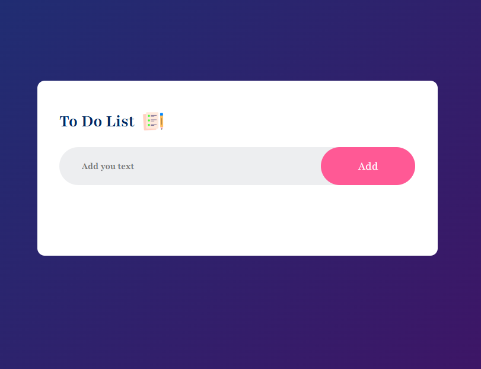
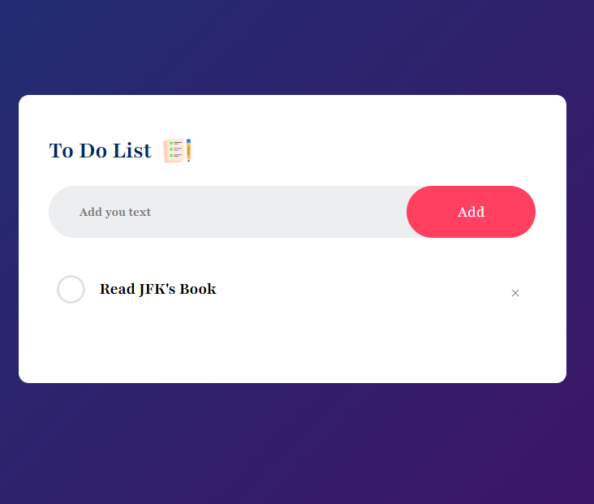
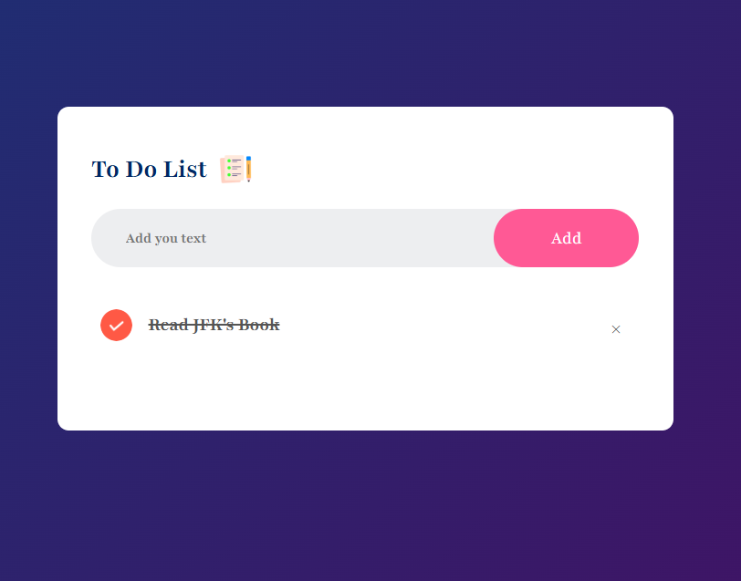

 
# TO-DO List Application

This is a simple **To-Do List Application** built using HTML, CSS, and JavaScript. The app allows users to add, mark as completed, and delete tasks. It also includes persistence using **localStorage**, ensuring that tasks remain saved even after refreshing the page.

## Features
- **Add tasks**: Users can input new tasks to their to-do list.
- **Mark tasks as completed**: Click on a task to toggle its completion state.
- **Delete tasks**: Remove tasks by clicking the delete icon (`x`).
- **Data persistence**: Tasks are saved in the browser's localStorage.
- **Responsive design**: The layout adapts to different screen sizes.

## Technologies Used
- **HTML**: Structure of the application.
- **CSS**: Styling, including custom fonts and responsive design.
- **JavaScript**: Functionality (e.g., adding tasks, saving to localStorage).

## How to Use
1. Clone the repository:
   ```bash
   git clone https://github.com/Harmandeep01/ToDoList.git
   ```
2. Navigate to the project directory:
   ```bash
   cd ToDoList
   ```
3. Open the `index.html` file in your browser to use the app.

## File Structure
```
project/
│
├── index.html      # Main HTML file
├── style.css       # CSS for styling
├── script.js       # JavaScript for functionality
└── img/            # Images used in the application
    ├── unchecked.png
    └── checked.png
```

## How It Works
1. **Add a Task**:
   - Enter a task in the input box and click the "Add" button.
   - The task will appear in the list below.
2. **Mark as Completed**:
   - Click on a task to toggle its completion state (line-through text and checked icon).
3. **Delete a Task**:
   - Click the `x` button next to a task to remove it from the list.
4. **Persistence**:
   - The application saves all tasks in the browser's localStorage.
   - When the page reloads, tasks are loaded from localStorage.

## Demo
A live demo of the application can be hosted on platforms like GitHub Pages or Netlify.

## Future Enhancements
- Add due dates for tasks.
- Include categories for better task organization.
- Allow users to prioritize tasks.
- Add a search functionality to filter tasks.

## Screenshots
1. **Main View:**
   The default view of the To-Do list.

   

2. **Adding a Task:**
   Example of adding a task to the list.

   

3. **Marking as Completed:**
   Marking tasks as completed by clicking on them.

   

## Contributing
Contributions are welcome! Feel free to open issues or submit pull requests to improve the project.

1. Fork the repository.
2. Create a new branch:
   ```bash
   git checkout -b feature-branch
   ```
3. Commit your changes:
   ```bash
   git commit -m "Add a new feature"
   ```
4. Push to the branch:
   ```bash
   git push origin feature-branch
   ```
5. Open a pull request.

## License
This project is licensed under the MIT License. See the [LICENSE](LICENSE.txt) file for details.

---

Enjoy building your to-do list! If you have any questions or feedback, feel free to reach out.

---

### Links
[LinkedIn](https://www.linkedin.com/in/harmandeep01/)

[GitHub](https://github.com/Harmandeep01)

---